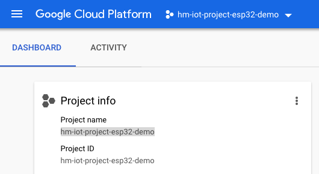
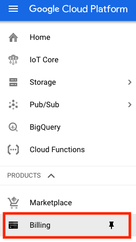

# ESP32 IoT client to connect to Google IoT Core

## Prerequisite
If you need some help to setup your ESP32 and Mongoose environment try [this](https://github.com/HiMinds/himinds-iot-project-embedded-esp32-mongoose-os-vscode-setup).

## Overview

In this project we are going to connect the Sparkfun ESP32 Thing board to the Google IoT core. We use the MQTT-bridge and we explore the following Google concepts:

* events, by sending ESP32 core temperature data, free ram and uptime
* state, sending hardware, revision, firmware and total ram
* config, set the temperature offset for built-in sensor 
* commands, turn on/off on-board LED

The temperature is accessed using the JavaScript library [api_esp32.js](https://github.com/mongoose-os-libs/mjs/blob/master/esp32/fs/api_esp32.js)
Which reads the built-in temperature sensor.


My colleague Edit Karasz has an excellent instruction for provisioning your Google IoT Core platform using Teraform, you can find the project [here](https://github.com/HiMinds/himinds-iot-project-cloud-terraform-gcp-template
). 
The Sparkfun board looks like this:


Schematics can be found [here](./docs/esp32-thing-schematic.pdf)

This instruction is based on the following [instruction](https://github.com/cesanta/mongoose-os-docs/blob/master/quickstart/cloud/google.md) made my Cesanta.

## Highly recommended links
* [Build a Weather Station using Google Cloud IoT Core and MongooseOS] (https://medium.com/google-cloud/build-a-weather-station-using-google-cloud-iot-core-and-mongooseos-7a78b69822c5)
* [Scalable IoT Integration
](https://coertvonk.com/sw/embedded/sonoff-mqtt-google-actions-23997)
* [Bike Route Data Gatherer
](https://www.hackster.io/PaulTR/bike-route-data-gatherer-12a831)


## Setup Google IoT Core

- Install [gcloud command line tool](https://cloud.google.com/sdk/gcloud/)
- Install beta components:

```
gcloud components install beta
```
- Authenticate with Google Cloud:

```
gcloud auth login
```

If you want to logout from all the accounts run the following command

```
gcloud auth revoke --all
```

If you want to logout from a specific account then run the following command

```
gcloud auth revoke <your_account>
```

- Create cloud project - choose your unique project name:

```
gcloud projects create YOUR_PROJECT_NAME
```

We are calling our project "hm-iot-project-esp32-demo"

```
gcloud projects create hm-iot-project-esp32-demo
```

If you login to your https://console.cloud.google.com account you should see the project in your drop down list. As seen below:




While you are logged in you also need to activate billing:




- Add permissions for IoT Core:

```
gcloud projects add-iam-policy-binding YOUR_PROJECT_NAME --member=serviceAccount:cloud-iot@system.gserviceaccount.com --role=roles/pubsub.publisher
```

- In our case it means:

```
gcloud projects add-iam-policy-binding hm-iot-project-esp32-demo --member=serviceAccount:cloud-iot@system.gserviceaccount.com --role=roles/pubsub.publisher
```

If billing is not activated you will get an error and you will not be able to proceed.


- Set default values for `gcloud`:

```
gcloud config set project YOUR_PROJECT_NAME
```

```
gcloud config set project hm-iot-project-esp32-demo
```


- Create PubSub topic for device data:

```
gcloud beta pubsub topics create iot-topic
```

- Create PubSub subscription for device data:

```
gcloud beta pubsub subscriptions create --topic iot-topic iot-subscription
```

- Create device registry, we use US to get full functionality:

```
gcloud beta iot registries create iot-registry --region us-central1 --event-pubsub-topic=iot-topic
```
## Setup Mongoose OS

```
mos gcp-iot-setup --gcp-project YOUR_PROJECT_ID --gcp-region us-central1 --gcp-registry iot-registry
```

```
`mos gcp-iot-setup --gcp-project hm-iot-project-esp32-demo --gcp-region us-central1 --gcp-registry iot-registry`
```

## Google MQTT Bridge
If you are used to working with MQTT there are some suprises...

The topics you can subscribe/publish to are pre-defined by Google.
Have a look in the [mos.yml](./mos.yml), you will see several GCP settings such as:

* ["gcp.enable", true]
* ["gcp.project", "hm-iot-project-esp32-demo"]
* ["gcp.region", "us-central1"]
* ["gcp.registry", "iot-registry"]
* ["gcp.device", "esp32_04FFB0"]
* ["gcp.key", "gcp-esp32_04FFB0.key.pem"]

You will have to replace gcp.device and gcp.key with your settings.

You will be working with the following "topics" with the following prefix /devices/{device-id}/:

### /events
Device events are used to publish information from the device, such as temperature, humidity etc.

### /state
Device state information captures the current status of the device, not the environment. Devices can describe their state with an arbitrary user-defined blob of data sent from the device to the cloud.

### /config
A device configuration is an arbitrary user-defined blob of data sent from Cloud IoT Core to a device.

### /commands
Commands are transitory, one-time directives sent to devices that are connected to Cloud IoT Core and subscribed to the commands topic. Commands can be useful when you want to:

* Send messages quickly to many devices at a specific time
* Send large-volume messages to many devices at a particular time
* Send time-bound directives that should expire
* Send incremental device settings


Google's documentation on the subject can be found [here](https://cloud.google.com/iot/docs/concepts/devices).